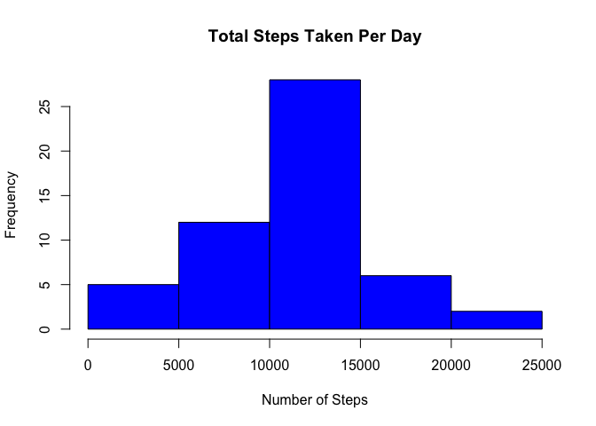
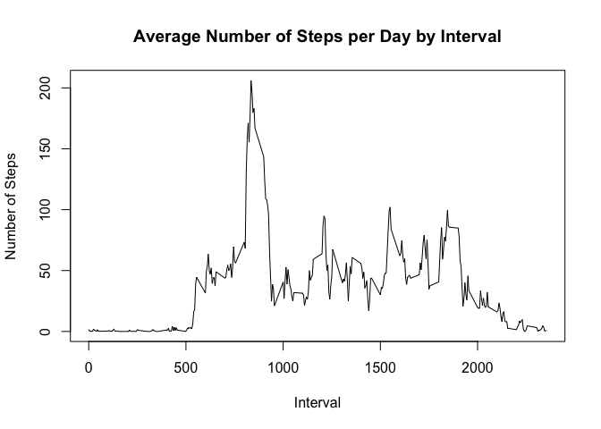
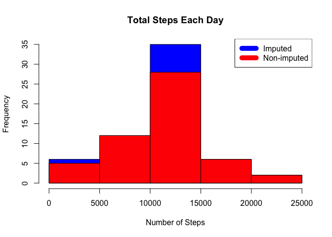
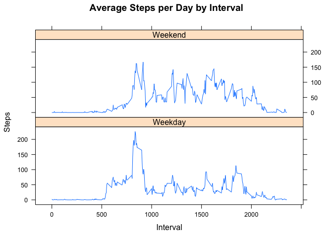

## Loading and preprocessing the data
Unzip data to obtain a csv file if have the zip file, otherwise download it. Read in the csv file.

```r
if(!file.exists("activity.csv")) {
  if (file.exists("activity.zip")){
    unzip("activity.zip")
    unlink("activity.zip")
  }else{
    temp <- tempfile()
    download.file("http://d396qusza40orc.cloudfront.net/repdata%2Fdata%2Factivity.zip",temp)
    if (file.exists("activity.zip")){
      unzip("activity.zip")
      unlink("activity.zip")
    }
  }
}

activity_data <- read.csv("activity.csv", stringsAsFactors=FALSE)
```


## What is mean total number of steps taken per day?
Sum the steps by day and create a histogram 


```r
steps_per_day <- aggregate(steps ~ date, activity_data, sum)
hist(steps_per_day$steps, main = paste("Total Steps Taken Per Day"), col="blue", xlab="Number of Steps")
```

<!-- -->

Calculate the mean and median


```r
step_mean <- mean(steps_per_day$steps)
step_median <- median(steps_per_day$steps)
```
The `mean` is 1.0766189\times 10^{4} and the `median` is 10765.


## What is the average daily activity pattern?
Calculate average steps for each interval for all days.
Plot the Average Number Steps per Day by Interval.
Find interval with most average steps.

```r
steps_by_interval <- aggregate(steps ~ interval, activity_data, mean)

plot(steps_by_interval$interval,steps_by_interval$steps, type="l", xlab="Interval", ylab="Number of Steps",main="Average Number of Steps per Day by Interval")
```

<!-- -->

```r
max_interval <- steps_by_interval[which.max(steps_by_interval$steps),1]
```
The 5-minute interval, on average across all the days in the data set, containing the maximum number of steps is 835.


## Imputing missing values
Missing data needed to be imputed. Only a simple imputation approach was required for this assignment. Missing values were imputed by inserting the average for each interval. 

```r
incomplete <- sum(!complete.cases(activity_data))
imputed_data <- transform(activity_data, steps = ifelse(is.na(activity_data$steps), steps_by_interval$steps[match(activity_data$interval, steps_by_interval$interval)], activity_data$steps))
```

Zeroes were imputed for 10-01-2012 because it was the first day and would have been over 9,000 steps higher than the following day, which had only 126 steps. NAs then were assumed to be zeros to fit the rising trend of the data.

```r
imputed_data[as.character(imputed_data$date) == "2012-10-01", 1] <- 0
```
Recount total steps by day and create Histogram.

```r
steps_per_day_imputed <- aggregate(steps ~ date, imputed_data, sum)
hist(steps_per_day_imputed$steps, main = paste("Total Steps Each Day"), col="blue", xlab="Number of Steps")

#Create Histogram to show difference. 
hist(steps_per_day$steps, main = paste("Total Steps Each Day"), col="red", xlab="Number of Steps", add=T)
legend("topright", c("Imputed", "Non-imputed"), col=c("blue", "red"), lwd=10)
```

<!-- -->

Calculate new mean and median for imputed data.

```r
step_mean_imputed <- mean(steps_per_day_imputed$steps)
step_median_imputed <- median(steps_per_day_imputed$steps)
```
Calculate difference between imputed and non-imputed data.


```r
mean_diff <- step_mean_imputed - step_mean
med_diff <- step_median_imputed - step_median
```
Calculate total difference.


```r
total_diff <- sum(steps_per_day_imputed$steps) - sum(steps_per_day$steps)
```
* The imputed data mean is 1.0589694\times 10^{4}
* The imputed data median is 1.0766189\times 10^{4}
* The difference between the non-imputed mean and imputed mean is -176.4948964
* The difference between the non-imputed median and imputed median is 1.1886792
* The difference between total number of steps between imputed and non-imputed data is 7.5363321\times 10^{4}. Thus, there were 7.5363321\times 10^{4} more steps in the imputed data.

## Are there differences in activity patterns between weekdays and weekends?
Created a plot to compare and contrast number of steps between the week and weekend. There is a higher peak earlier on weekdays, and more overall activity on weekends.  

```r
weekdays <- c("Monday", "Tuesday", "Wednesday", "Thursday", 
              "Friday")
imputed_data$dow = as.factor(ifelse(is.element(weekdays(as.Date(imputed_data$date)),weekdays), "Weekday", "Weekend"))

steps_per_interval_imputed <- aggregate(steps ~ interval + dow, imputed_data, mean)

library(lattice)

xyplot(steps_per_interval_imputed$steps ~ steps_per_interval_imputed$interval|steps_per_interval_imputed$dow, main="Average Steps per Day by Interval",xlab="Interval", ylab="Steps",layout=c(1,2), type="l")
```

<!-- -->
